# MyBank

**Note: This app is currently hosted
at [https://laravelmoney.000webhostapp.com/](https://laravelmoney.000webhostapp.com/)**

MyBank is an internet banking app built with PHP 7.4 and the Laravel 8 framework. It allows users to perform various
banking operations, including money conversion, cryptocurrency trading, account management, and money transfers to other
users' accounts.

## Features

- User Registration: Easily register an account with a unique email and personal code.
- Account Creation and Deletion: Users can create investment or standard bank accounts and have the option to delete
  them if the account balance is zero. The account deletion is performed at the user's discretion.
- Money Conversion: Convert money to different currencies using
  the [Latvijas Banka API](https://www.latvijasbanka.lv/vk/ecb.xml).
- Cryptocurrency Trading: Buy and sell cryptocurrencies with real-time data from
  the [CoinMarketCap API](https://pro-api.coinmarketcap.com/v1/).
- Transaction History: View your transaction history for easy tracking.
- Two-Factor Authentication (2FA): Enable 2FA for secure login and money transfers.
- Money Transfers: Send money to other users' accounts within the app.

## Getting Started

To get started with MyBank, follow these steps:

1. Install dependencies by running: `composer install`.
2. Configure your environment variables in the `.env.example` file and update
   the necessary values.Dont forgot about CoinMarketCap API Key .Rename the `.env.example` file to `.env`.
3. Generate the application key: `php artisan key:generate`.
4. Set up the database by running: `php artisan migrate`.
5. Start the local development server: `php artisan serve`.
6. Access the app in your browser at: `http://localhost:8000`.

**Note: In this version the current version of the app is optimized for computer browsers and may not provide an optimal
experience on
mobile phones.**

## Account Management

Users can create investment or standard bank accounts within MyBank. They also have the option to delete their accounts
if the balance reaches zero. Account deletion is performed at the user's discretion.

## API

MyBank provides the following APIs:

- Money Conversion API: Convert money to different currencies by fetching exchange rates from
  the [Latvijas Banka API](https://www.latvijasbanka.lv/vk/ecb.xml).
- Cryptocurrency API: Perform cryptocurrency trading with real-time data from
  the [CoinMarketCap API](https://pro-api.coinmarketcap.com/v1/).

## Security

MyBank prioritizes security with the following measures:

- Secure Authentication: 2FA is implemented for secure login and money transfers.
- Password Encryption: User passwords are securely encrypted to protect user information.
- Validation: User registration and money transfer processes include various validations to ensure data accuracy.

## Support and Feedback

For any questions, feedback, or issues, please contact me algis.bernatovics@gmail.com

## License

This project is licensed under the [MIT License](LICENSE).

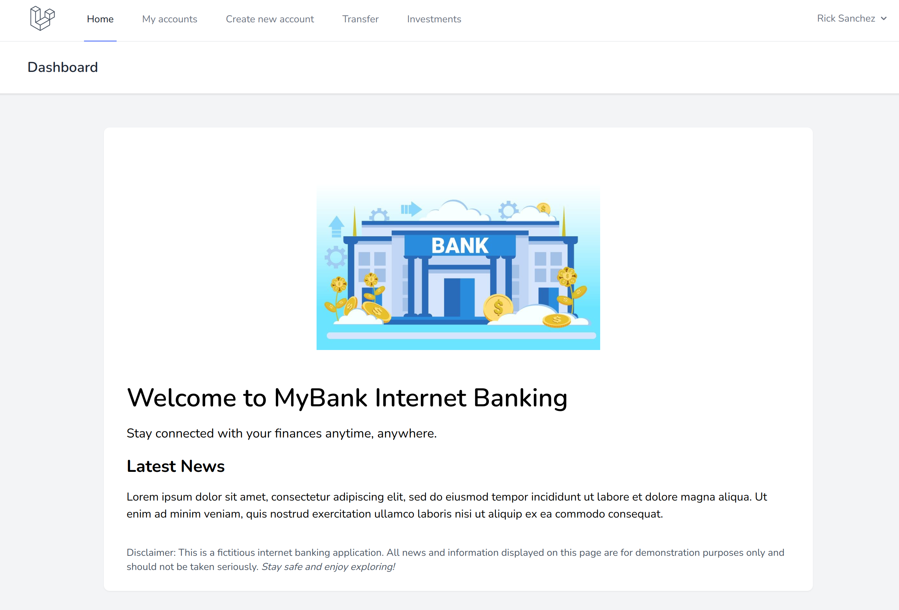
 
---------------------------------------------------------------------------------------------------------------------------------------------------------------------------------------------
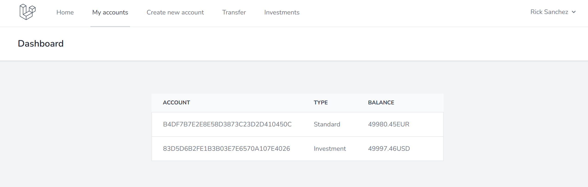
 
---------------------------------------------------------------------------------------------------------------------------------------------------------------------------------------------
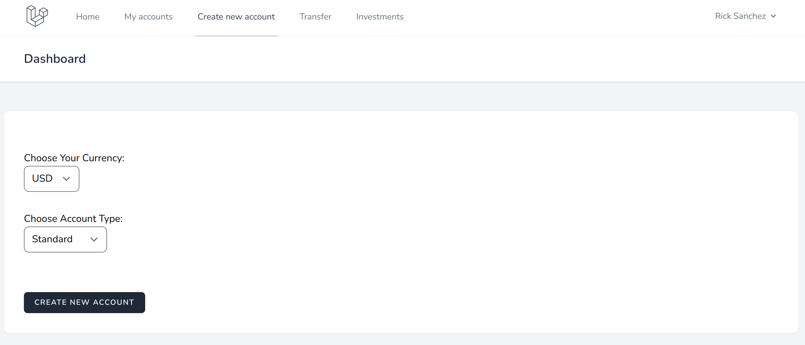
 
---------------------------------------------------------------------------------------------------------------------------------------------------------------------------------------------
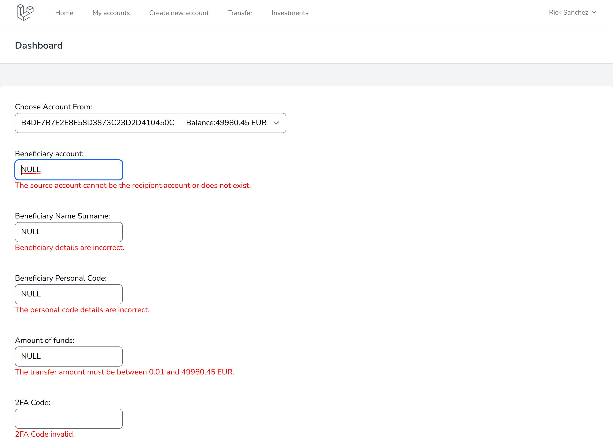
 
---------------------------------------------------------------------------------------------------------------------------------------------------------------------------------------------
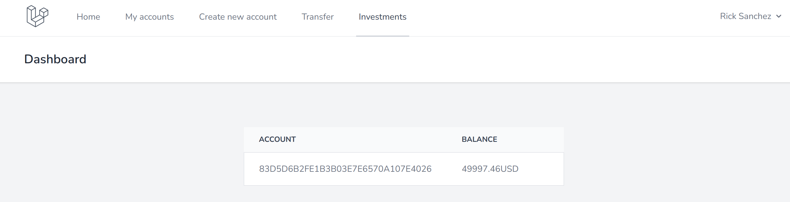
 
---------------------------------------------------------------------------------------------------------------------------------------------------------------------------------------------
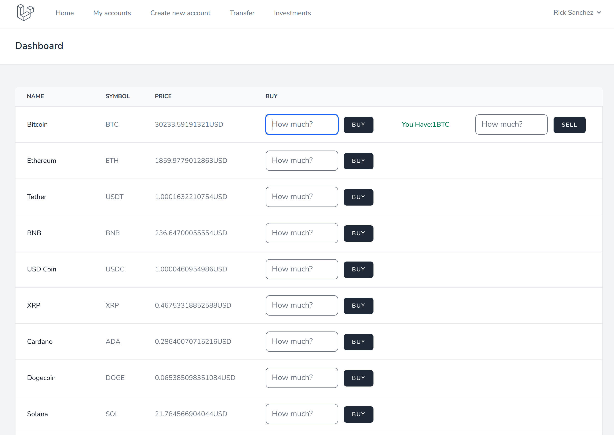
 
---------------------------------------------------------------------------------------------------------------------------------------------------------------------------------------------
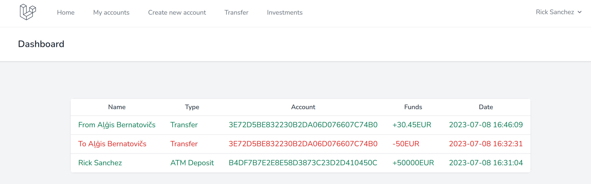
 
---------------------------------------------------------------------------------------------------------------------------------------------------------------------------------------------
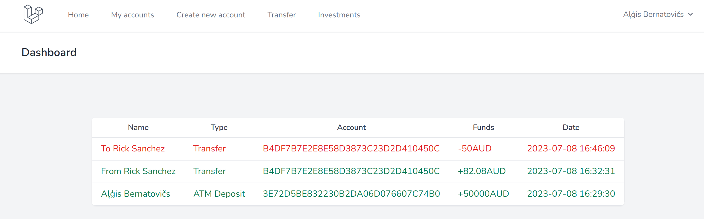
 
---------------------------------------------------------------------------------------------------------------------------------------------------------------------------------------------
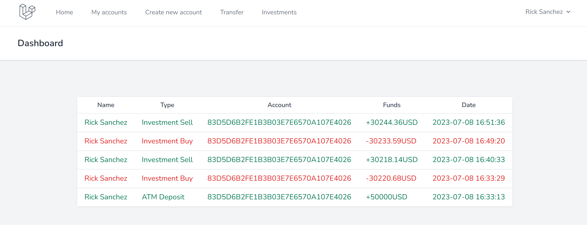
 
---------------------------------------------------------------------------------------------------------------------------------------------------------------------------------------------
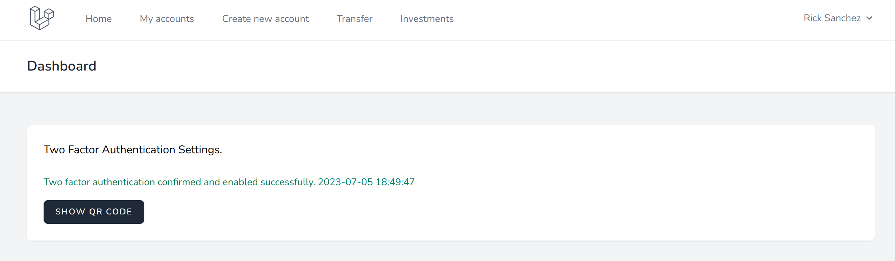
 
---------------------------------------------------------------------------------------------------------------------------------------------------------------------------------------------
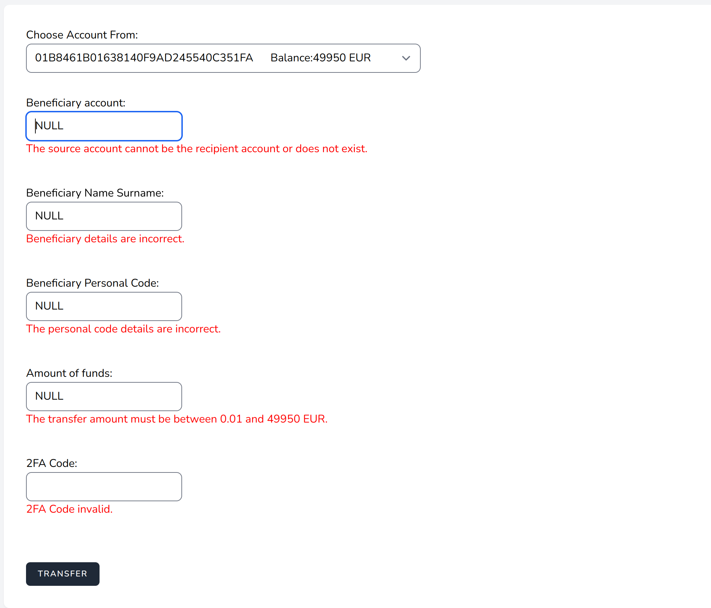
 
---------------------------------------------------------------------------------------------------------------------------------------------------------------------------------------------
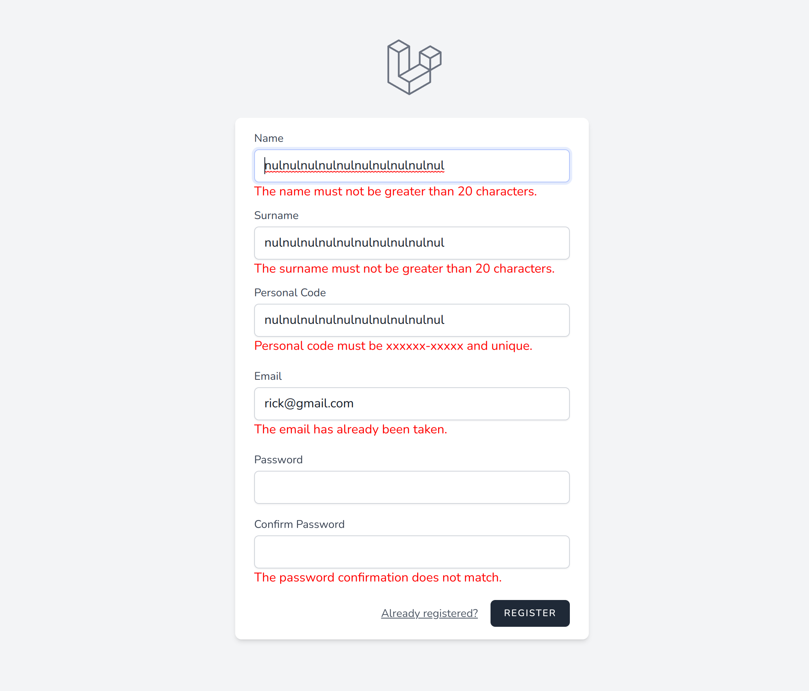
 
---------------------------------------------------------------------------------------------------------------------------------------------------------------------------------------------
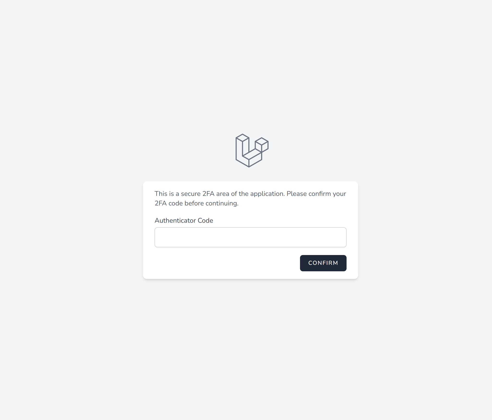

